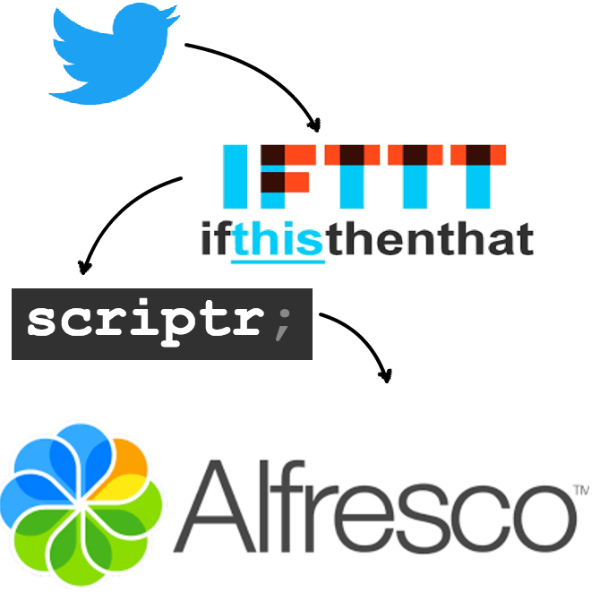

# Alfresco-scriptr.io-snippets
This script is a POC for connecting Twitter to Alfresco via IFTTT and Scriptr.io. See the IFTTT config below, which fires everytime the #Beecon2017 hashtag is used in a tweet - it calls Scriptr.io which runs (twiiter2alfrescoRM.js) which then formats the record and declares that in an RM site. 

## IFTTT
.png)
